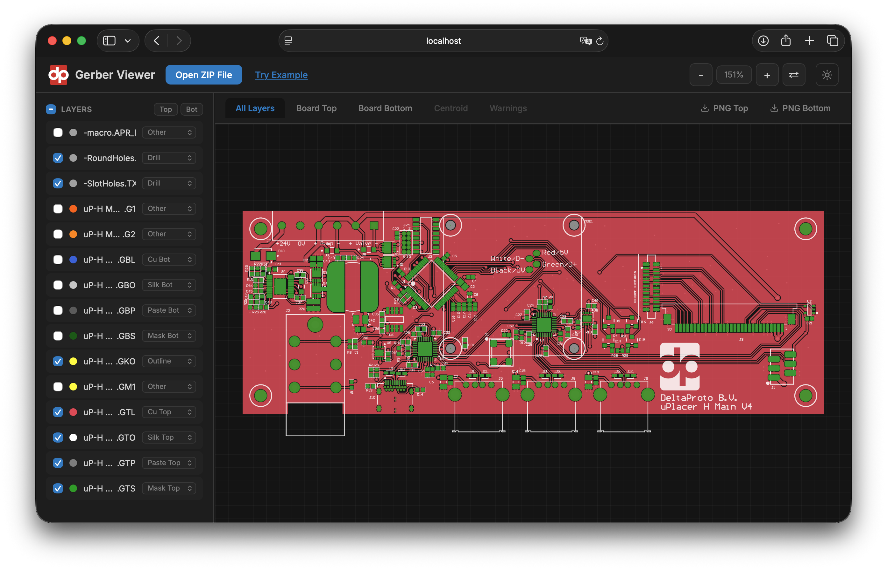
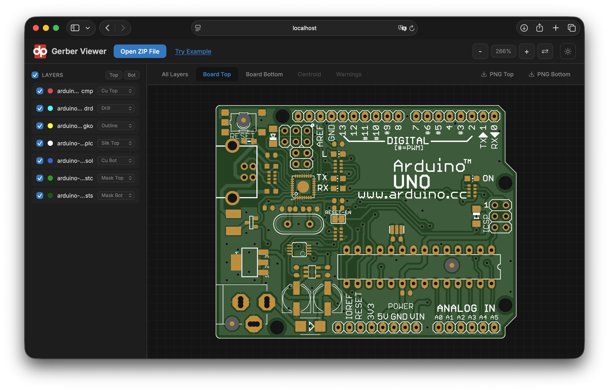
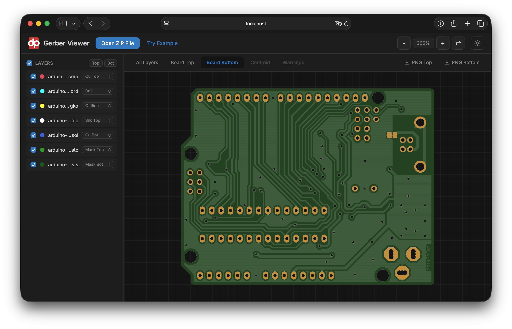
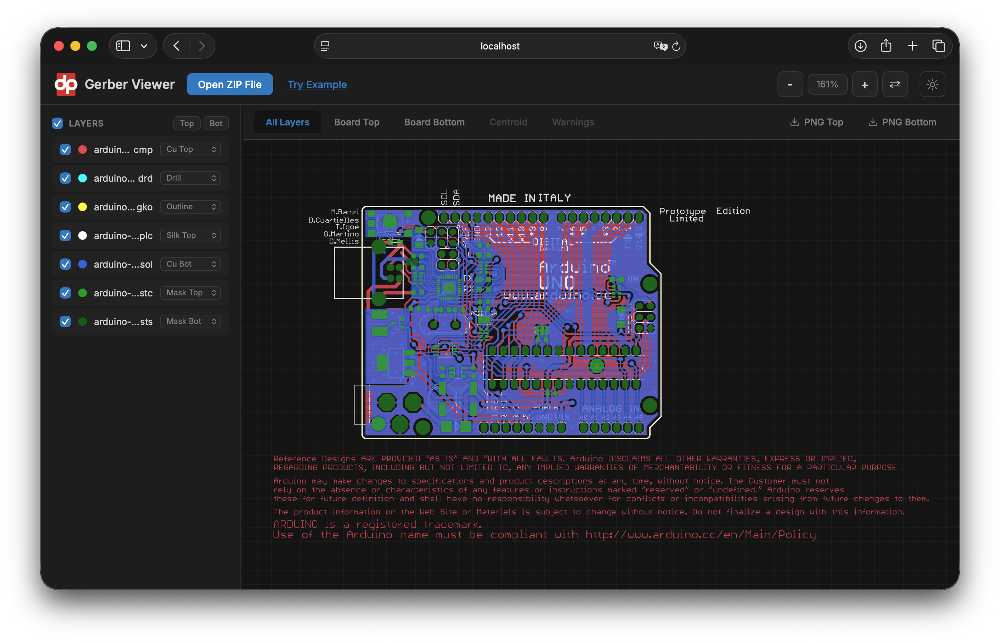
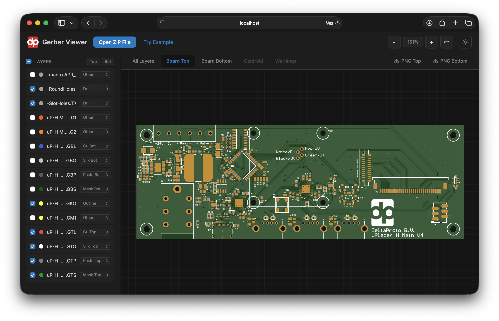

# Delta Gerber

A Java library for parsing Gerber RS-274X and Excellon NC drill files with SVG and PNG rendering, realistic PCB visualization, and an interactive web viewer.

**[Try the online viewer at deltaproto.com](https://deltaproto.com/opensource-gerber-viewer)** — no install needed, runs in your browser.



## Realistic PCB Rendering

Generate photorealistic top and bottom views of your PCB with proper layer stacking — FR4 substrate, copper with HASL/ENIG finish, semi-transparent soldermask, silkscreen, and drill holes with true SVG transparency.

| Board Top | Board Bottom |
|-----------|--------------|
|  |  |

| All Layers | Realistic Top |
|------------|---------------|
|  |  |

## Maven Dependency

```xml
<dependency>
    <groupId>com.deltaproto</groupId>
    <artifactId>delta-gerber</artifactId>
    <version>1.1.6</version>
</dependency>
```

## Features

### Gerber Parsing
- Full RS-274X support (.gbr, .ger, .gtl, .gbl, .gts, .gbs, .gto, .gbo, .gtp, .gbp, .gko, .gm, etc.)
- All standard apertures: circle (C), rectangle (R), obround (O), polygon (P)
- Aperture macros with primitives (circle, vector line incl. legacy code 2, center line, outline, polygon, moiré, thermal) with variable expressions
- Region fills (G36/G37) with multiple contours
- Arc interpolation (G02/G03) with single and multi-quadrant modes
- Layer polarity (LPD/LPC) with true SVG mask-based transparency
- Step and Repeat (%SR%) for panelized boards
- Block apertures (%AB%) with full flash expansion, nesting, transforms and LPC polarity toggling
- Aperture transforms: rotation (LR), scaling (LS), mirroring (LM)
- **Full Gerber X3 / X2 attribute compliance** — every standard attribute (TF file, TA aperture,
  TO object, TD delete) is parsed into a typed, queryable model verified against the Ucamco
  **2024.05** specification:
  - **File**: `.FileFunction`, `.FilePolarity`, `.Part`, `.GenerationSoftware`, `.CreationDate`,
    `.ProjectId`, `.MD5`, `.SameCoordinates`
  - **Aperture**: the complete `.AperFunction` set (32 values, typed enum), `.DrillTolerance`
    (mm-normalized), `.FlashText`
  - **Object / X3 assembly**: nets (`.N`), pins (`.P`), component refdes (`.C`) and the full
    `.Cxxx` component characteristics — value, mfr, MPN, mount, rotation, package, library, and
    height (`.CHgt`, mm-normalized) — plus pick-and-place centroid extraction
- Image polarity (%IP%): negative-image inversion rendering; image offset (%OF%) recognition

### Excellon Drill Parsing
- Standard Excellon NC drill format (.drl, .txt, .xln, .drd)
- Tool definitions with diameter
- Drill hits and routed slots (G85, M15/M16/M17 routing mode)
- Plated (PTH) and non-plated (NPTH) hole distinction
- Absolute and incremental coordinate modes (G90/G91)
- Metric and inch units with automatic format detection

### IPC-D-356A Netlist Parsing
- Bare-board electrical-test netlist reader (`.ipc`, `.ipc356`) for connectivity / test-point data
- Test points: `317` through-hole, `327` SMD, `367` non-plated tooling, `307` blind/buried via —
  with net, ref-des/pin (incl. `VIA` and mid-net `M`), hole + plating, access side, location,
  feature size and rotation, soldermask
- Conductor segments (`378`/`078`) with modal coordinates and space/asterisk-delimited chains,
  net adjacency (`379`/`079`), and board/panel outlines (`389`/`089`)
- Continuation records: `017`/`027` hole, `099` test-point location, `088` soldermask clearance
- Long-net-name aliases (`P NNAME`), resolved into full net names — tolerates the non-standard
  Allegro alias-as-comment quirk
- Coordinates and sizes normalized to **mm** at parse time (from `CUST` 0.0001 inch or `SI`
  0.001 mm), sharing one coordinate space with Gerber/drill geometry
- Non-fatal parse warnings (missing `P UNITS`, unknown op codes, truncated records) instead of
  exceptions

### CAD Tool Compatibility
- **Altium Designer** — Gerber X2 attributes, mechanical layer outlines (.GM, .GM1), format detection
- **Cadence Allegro** — Non-standard drill format with holesize comments, M00 tool separators, repeat codes (R02X...)
- **EAGLE** — Non-standard OC8/OCn octagon aperture type, combined FS+MO command blocks
- **KiCad** — Standard Gerber X2 output with file function attributes
- **Legacy RS-274X** — Deprecated G-codes (G54, G70/G71), deprecated extended commands (%IN, %LN, %AS, %MI, %SF, %IR%)
- **UTF-8 BOM** handling for files exported from Windows tools

### SVG Rendering
- High-fidelity SVG output with native SVG elements (circles, arcs, paths)
- Polygonized mode for geometry processing
- Multi-layer composite rendering with configurable colors and opacity
- Realistic PCB rendering with physically accurate layer stacking:
  - FR4 substrate, copper (silver under mask / gold at exposed pads)
  - Semi-transparent soldermask with inverted mask for pad openings
  - Silkscreen nested inside soldermask (only visible where mask is present)
  - Drill holes punching through all layers as true SVG transparency
- Derived board outline when no GKO/outline layer is present — the board edge is
  reconstructed from the copper-union silhouette so the realistic view still works

### PNG / Raster Output
- Per-layer PNG export for single Gerber or drill layers (`SVGRenderer.renderPng`,
  `DrillSVGRenderer.renderPng`) — ideal for feeding individual layers to vision models
- Realistic top/bottom PNGs (`renderRealisticSidePng`), dimension-clamped to keep
  memory bounded on large boards
- Scale-aware export (`renderRealisticSidePngWithScale` → `PngWithScale`) carrying
  px↔mm geometry, embedded directly in the PNG via `pHYs` + `tEXt` chunks
- Board overview PNG (`renderBoardOverviewPng`) — composites the realistic board over
  an all-layers underlay so off-board annotations (drill charts, stackup tables, fab
  notes) stay visible; scales to dense multi-layer boards via a raster silhouette path

### STEP / 3D Export
- **Board outline as a STEP solid** (`renderer.step.StepExporter`) — the resolved board edge
  extruded to a finished thickness and written as an ISO 10303-21 (AP214) B-rep, ready to drop
  into an enclosure design in any MCAD tool
- Uses the same outline the realistic view is clipped to: a real profile layer when the set ships
  one (internal cut-outs and all), otherwise the silhouette derived from the copper
- **Drilled holes included** — mounting holes, vias and slots are subtracted from the solid, and
  because a hole is subtracted whether or not it lies inside the board, the **mouse bites** on a
  break-off tab scallop the board edge just as the router leaves them
- **`TOP` and `BOTTOM` written on the two faces** as engraving-style annotation curves (the
  underside mirrored, so it reads from below) — a bare silhouette gives no other clue which face
  is which. They are a separate wireframe representation and leave the solid untouched
- Thickness defaults to 1.6 mm — the ordinary FR-4 board — and is caller-settable; a set that
  ships a `.gbrjob` or IPC-2581 stack-up can pass its declared `getBoardThicknessMm()`

### Board Analysis & DFM
- `PcbAnalyzer` reduces a whole folder of Gerber + drill files to one `BoardSpecification`:
  board size, copper layer count, soldermask / silkscreen / stencil sides, minimum track width
  (µm) and minimum drill diameter (mm) — classifying every file first, then measuring only what
  can change the answer
- **Via-in-pad detection** — determines whether any drilled hole lands inside a surface-mount pad
  (read from the solder-paste layer), and groups the holes by the pad they sit in, with that pad's
  area, so a *thermal via field* under a QFN/BGA heat pad is told apart from a via in a signal land.
  Only the second forces a filled-and-capped via process (**IPC-4761 Type VII**) and its cost and
  lead time. Surfaced as `spec.hasViaInPad()` / `requiresFilledAndCappedVias()` /
  `getViaInPadGroups()`, or standalone via `dfm.ViaInPadDetector`
- **Annular ring check** — the copper left between a drilled hole and the edge of its pad, hole by
  hole and layer by layer, measured in the *worst direction* rather than as `(pad − hole) / 2`.
  Surfaced as `spec.getMinAnnularRingMm()` / `isAnnularRingWithinPolicy()` /
  `getAnnularRingViolations()`, or standalone via `dfm.AnnularRingDetector`. Non-plated holes are
  exempt (they need no ring), a hole that breaks out of its pad is told apart from a tight one, and
  a plated hole with no pad at all is reported separately rather than as a ring of zero
- **Physical stack-up** (`spec.getStack()`) — the board top to bottom as a list of `StackEntry`:
  copper, dielectric, mask, legend and paste, each with its thickness in picometres, plus the
  finished **board thickness** (`spec.getBoardThicknessPm()`). Read from a `.gbrjob`'s
  `MaterialStackup` or from an **IPC-2581** file's `Stackup` (`Ipc2581StackupParser`, streamed and
  stopped at `</Stackup>` so a 158 MB file costs milliseconds), and otherwise estimated from the
  layers the set does have
- **Coordinate format reporting** (`spec.getGerberFormat()` / `getDrillFormat()`) — the "4:3,
  leading zeros suppressed" a fabricator asks for, per file and for the set, plus
  `isFormatConsistent()`: whether the drill program was exported in the same terms as the artwork
- Drill/Gerber origin auto-alignment (`DrillGerberAlignment`) recovers an exact offset when the NC
  drill was exported on a different origin than the copper (e.g. some Altium flows), so holes and
  pads share one coordinate space before any analysis

### Parse Diagnostics
- Both Gerber and drill documents expose a de-duplicated list of parse warnings
- Malformed, truncated, or hostile files degrade gracefully with a recorded warning
  instead of crashing or producing a blank render

### Web Viewer
- Interactive pan/zoom with mouse wheel and drag
- Three visualization modes: All Layers, Board Top, Board Bottom
- 10 × 10 mm backdrop grid that pans and zooms with the board, so it reads as a scale
- Zoom controls in the viewer's corner, and the running version in the header
- PNG Top/Bottom export of the realistic view
- STEP export of the board outline, with an editable board thickness (default 1.6 mm)
- PCB info tab: board size, layer count, processes, tolerances, via-in-pad, and the coordinate
  format each file was exported in
- Warnings tab listing per-file parse warnings (disabled when there are none)
- Layer type auto-detection from filename and content analysis
- Layer type dropdowns for manual override
- Select all/none checkbox with tri-state indicator
- Top/Bottom quick-filter buttons
- Hover-to-solo: preview individual layers by hovering
- Center-truncated filenames with instant tooltips
- Browser-side ZIP extraction and file persistence (IndexedDB)
- Recent project history with re-open support
- Stateless server architecture (browser owns the data)

## Quick Start — Download and Run

Download the standalone JAR from the [latest release](https://github.com/Delta-Proto/delta-gerber/releases/latest) and run:

```bash
java -jar delta-gerber-1.1.6-jar-with-dependencies.jar
```

Open http://localhost:9380 and drop a Gerber ZIP file onto the viewer, or click **"Try Example"** to load the bundled Arduino Uno board.

> Requires Java 17+. No other dependencies needed.

### Build from Source

```bash
mvn clean package
java -jar target/delta-gerber-1.1.6-jar-with-dependencies.jar
```

## Usage as Library

```java
// Parse a Gerber file
GerberParser parser = new GerberParser();
GerberDocument doc = parser.parse(gerberContent);

// Render a single layer to SVG
SVGRenderer renderer = new SVGRenderer();
String svg = renderer.render(doc);

// Parse an Excellon drill file
ExcellonParser drillParser = new ExcellonParser();
DrillDocument drillDoc = drillParser.parse(excellonContent);
```

### Multi-Layer Rendering

```java
MultiLayerSVGRenderer renderer = new MultiLayerSVGRenderer();
List<MultiLayerSVGRenderer.Layer> layers = new ArrayList<>();
layers.add(new MultiLayerSVGRenderer.Layer("top-copper", copperDoc)
    .setColor("#e94560").setOpacity(0.85));
layers.add(new MultiLayerSVGRenderer.Layer("drill", drillDoc)
    .setColor("#00ffff"));

String svg = renderer.render(layers);
```

### Component Placement (Pick-and-Place / Centroid)

KiCad and other EDA tools can export component placement data as Gerber X2 files with `%TF.FileFunction,Component,...*%`. The parser extracts the centroid of each component and makes it available as a `List<ComponentPlacement>`.

```java
GerberParser parser = new GerberParser();
GerberDocument doc = parser.parse(pnpFileContent);

if (doc.isComponentFile()) {
    String side = doc.getComponentSide(); // "Top" or "Bottom"
    List<ComponentPlacement> components = doc.getComponents();

    for (ComponentPlacement c : components) {
        System.out.printf("%s\t%s\t%s\t%.4f\t%.4f\t%.1f\t%s%n",
            c.getRefdes(),     // e.g. "R1"
            c.getValue(),      // e.g. "10k"
            c.getFootprint(),  // e.g. "R_0402_1005Metric"
            c.getX(),          // centroid X in mm
            c.getY(),          // centroid Y in mm
            c.getRotation(),   // degrees
            c.getSide());      // "Top" or "Bottom"
    }
}
```

**Export to CSV:**

```java
StringBuilder csv = new StringBuilder("Designator,Value,Footprint,MountType,X_mm,Y_mm,Rotation_deg,Side\n");
for (ComponentPlacement c : doc.getComponents()) {
    csv.append(String.format(Locale.US, "\"%s\",\"%s\",\"%s\",\"%s\",%.4f,%.4f,%.2f,\"%s\"%n",
        c.getRefdes(), c.getValue(), c.getFootprint(), c.getMountType(),
        c.getX(), c.getY(), c.getRotation(), c.getSide()));
}
Files.writeString(Path.of("centroid.csv"), csv.toString());
```

If you have separate top and bottom PnP files, parse each one independently and combine the lists:

```java
GerberParser parser = new GerberParser();
List<ComponentPlacement> all = new ArrayList<>();
all.addAll(parser.parse(pnpTopContent).getComponents());
all.addAll(parser.parse(pnpBottomContent).getComponents());
```

Each coordinate is in **millimetres**, normalised at parse time regardless of the source file unit. The `mountType` field is `"SMD"` or `"TH"` as declared in `%TO.CMnt*%`.

### Board Specification & Via-in-Pad Detection

Give `PcbAnalyzer` the whole file set and it returns a `BoardSpecification` describing the bare
board — size, layer count, processes, tolerances — and, when the set has both a solder-paste layer
and a drill, whether the board has any **via in pad**.

```java
import com.deltaproto.deltagerber.spec.PcbAnalyzer;
import com.deltaproto.deltagerber.spec.PcbFile;
import com.deltaproto.deltagerber.spec.BoardSpecification;

// One PcbFile per file in the customer's Gerber/drill set. The analyzer classifies each by
// name + content, so you do not have to tell it which file is which.
List<PcbFile> files = List.of(
    PcbFile.of("board-Edge_Cuts.gbr", outlineBytes),
    PcbFile.of("board-F_Cu.gbr",      topCopperBytes),
    PcbFile.of("board-F_Paste.gbr",   topPasteBytes),   // the paste layer is what defines SMD pads
    PcbFile.of("board-PTH.drl",       drillBytes));

BoardSpecification spec = new PcbAnalyzer().analyze(files);

Boolean viaInPad = spec.hasViaInPad();                    // a hole sits in a pad at all
Boolean needsFill = spec.requiresFilledAndCappedVias();   // ... and it has to be plugged
int     count    = spec.getViaInPadCount();
```

Both are **nullable** `Boolean`s on purpose:

| Value   | Meaning                                                                          |
|---------|----------------------------------------------------------------------------------|
| `TRUE`  | `hasViaInPad`: a hole sits inside an SMD pad. `requiresFilledAndCappedVias`: and at least one such pad needs IPC-4761 Type VII |
| `FALSE` | Paste and drill were both present, and no hole falls in a pad / every pad that caught one is thermal |
| `null`  | Not determined — the set had no paste layer, or no drill, so the question is open |

`PcbFile.of` accepts a `String` or a `byte[]`; bytes are decoded as ISO-8859-1 (both formats are
ASCII), so you can hand it raw upload bytes directly. Customer files should never be committed to a
public repo — keep them out of version control.

#### Thermal via field, or a via that has to be plugged?

`hasViaInPad()` is a geometric fact; `requiresFilledAndCappedVias()` is the process verdict, and
they differ on the most common board there is. Nine vias under a QFN heat pad and one via in an
0402 land look identical hole by hole — but the heat pad is 9 mm² of paste with room to spare, so
what wicks down the barrels does not starve anything, while the 0402 land drains dry and the via
must be filled and capped.

The detector therefore groups the holes by the pad they land in and measures that pad. A pad counts
as **thermal** — no capping needed — when either signal holds:

| Signal | Default | Why |
|---|---|---|
| Several vias in one pad | ≥ 2 | Nobody puts a via array in a signal land; a via field only appears under a heat spreader |
| Pad far larger than its holes | ≥ 25× the hole area, and ≥ 2.0 mm² | A large land carries enough paste that what drains away does not starve the joint |

Those defaults put the cut between a QFN/DFN heat pad and a discrete land (an SOIC land is ~0.9 mm²,
an 1206 land ~1.9 mm²). Fabricators disagree about where exactly it sits, so pass your own
`ViaInPadPolicy` to any of the judging methods:

```java
import com.deltaproto.deltagerber.dfm.ViaInPadGroup;
import com.deltaproto.deltagerber.dfm.ViaInPadPolicy;

// Stricter house rule: only a real via field, or a pad 50× its holes and at least 4 mm².
ViaInPadPolicy strict = new ViaInPadPolicy(2, 50.0, 4.0);
Boolean needsFill = spec.requiresFilledAndCappedVias(strict);

for (ViaInPadGroup pad : spec.getViaInPadGroups()) {
    System.out.printf("%s pad at (%.3f, %.3f): %.3f mm² %s, %d via(s) ⌀%.3f mm, %.1f× → %s%n",
        pad.isTop() ? "top" : "bottom", pad.getPadCenterX(), pad.getPadCenterY(),
        pad.getPadAreaMm2(), pad.getPadShape(), pad.getViaCount(), pad.getViaDiameterMm(),
        pad.getPadToViaAreaRatio(),
        pad.isLikelyThermal() ? "thermal, leave open" : "fill & cap");
}
```

```
top pad at (10.000, 10.000): 9.000 mm² R, 4 via(s) ⌀0.300 mm, 31.8× → thermal, leave open
top pad at (20.000, 20.000): 0.503 mm² C, 1 via(s) ⌀0.300 mm, 7.1× → fill & cap
```

The pad area is the paste opening itself — the aperture as flashed (rotation and scale included) or
the painted region, not its bounding box, which would overstate a round or obround land by a third.
`getFilledAndCappedGroups()` and `getThermalGroups()` (both with a policy overload) split the list
for you.

#### Integrating into a calculator / quoting flow

```java
BoardSpecification spec = new PcbAnalyzer().analyze(files);

// Flag the extra process only on a positive result; treat null (unknown) as "no data",
// not as a pass — the same way you would treat a missing paste layer. Key off the verdict, not
// hasViaInPad(): a board whose only vias in pad are thermal fields needs no via fill.
if (Boolean.TRUE.equals(spec.requiresFilledAndCappedVias())) {
    quote.requireProcess(Process.IPC_4761_TYPE_VII);   // filled & capped vias
    quote.addNote(spec.getViaInPad().getFilledAndCappedGroups().size()
            + " pad(s) with a via that must be plugged, on " + spec.getViaInPadSide());
}
```

For the full list of offending holes (each with its location and drilled diameter), read the
detection result off the spec:

```java
import com.deltaproto.deltagerber.dfm.ViaInPad;
import com.deltaproto.deltagerber.dfm.ViaInPadResult;

ViaInPadResult vip = spec.getViaInPad();   // null when detection did not run
if (vip != null) {
    for (ViaInPad v : vip.getViaInPads()) {
        System.out.printf("via in pad at (%.3f, %.3f) mm, ⌀%.3f mm%n",
            v.getX(), v.getY(), v.getHoleDiameterMm());
    }
}
```

If you have already parsed the paste and drill documents for another purpose (rendering, say),
call the detector directly instead of re-analysing — pass the paste layers split by side, and use
`detectAligned(...)` when the drill might be on a different origin than the copper:

```java
import com.deltaproto.deltagerber.dfm.ViaInPadDetector;

ViaInPadResult vip = ViaInPadDetector.detect(
    List.of(topPasteDoc),      // top-side paste GerberDocuments
    List.of(bottomPasteDoc),   // bottom-side paste GerberDocuments
    List.of(drillDoc));        // Excellon DrillDocuments (already in the Gerber coordinate frame)

boolean anyViaInPad  = vip.hasViaInPad();              // the geometric fact
boolean needsViaFill = vip.requiresFilledAndCapped();  // the process verdict — quote off this
```

> Cost note: at `AnalysisDepth.SPECIFICATION` the analyzer skips parsing layers that can't change
> the spec (a large silkscreen, for instance) but still parses the small paste layer when a drill
> is present, so via-in-pad is reported at both depths.

### Annular Ring

The copper between the wall of a drilled hole and the edge of its pad — the "min annular ring" line
on a fabricator's capability table. It needs the drill program and the copper layers correlated,
which the analyzer does for you:

```java
BoardSpecification spec = new PcbAnalyzer().analyze(files);

Double  ring    = spec.getMinAnnularRingMm();          // the board's tightest ring, null if unknown
Boolean clears  = spec.isAnnularRingWithinPolicy();    // ... against 0.15 mm, the standard rule
List<AnnularRing> tight = spec.getAnnularRingViolations();
```

The ring is the **shortest distance from the hole's edge to the pad's edge over every direction**,
not half the difference of two diameters. On an obround pad the short axis decides; a hole that sits
off-centre in its pad has less copper on one side, and that side is the one that breaks out. It is
measured against the *drilled* diameter, before plating shrinks the finished hole.

A hole is measured on **every copper layer whose pad it passes through**, and the per-layer
breakdown is what a designer fixes:

```java
for (AnnularRing hole : spec.getAnnularRing().getViolations()) {
    System.out.printf("⌀%.3f hole at (%.3f, %.3f): %.3f mm%n",
        hole.getHoleDiameterMm(), hole.getX(), hole.getY(), hole.getMinRingMm());
    for (PadRing pad : hole.getPads()) {
        System.out.printf("    %-14s %s%s  ring %.3f mm  (%s pad)%n",
            pad.getLayerName(), pad.getSide(),
            pad.getLayerNumber() == null ? "" : " " + pad.getLayerNumber(),
            pad.getRingMm(), pad.getPadShape());
    }
}
```

Three answers, and they are not the same one:

| Question | Answer |
|---|---|
| `getMinRingMm()` | the board's tightest ring — the quote-form figure |
| `getViolations(policy)` | the holes under the rule; `hasBreakout()` separates the ones already outside their pad |
| `getPlatedHolesWithoutPad()` | plated holes with no pad on any layer — a missing pad, not a thin ring |

**What counts as a pad.** A flash or a short stroke whose ink contains the hole's *centre*. A flash
is what most tools emit; a stroke — an aperture swept along a stub — is how EAGLE and others draw an
oblong through-hole pad, and two thirds of the Arduino Uno's pads are drawn that way. A poured
region is **not** a pad: a plane swallows every hole crossing it, and a via merely passing through
is not sitting in a pad. Clear (`%LPC*%`) features erase what is under them, so a via through an
antipad reports *no pad on that layer* rather than a ring of zero. Pad geometry is exact for
circles, rectangles, obrounds, polygons and **aperture macros** — Altium's rounded-rectangle pads
are measured to their real outline, not their bounding box.

**Non-plated holes are not measured at all.** They have no barrel to connect to a pad, so a ⌀3.2 mm
mounting hole punched through a plane is exempt rather than a spectacular breakout. Plating is read
per tool from the Excellon `;TYPE=PLATED` / `;TYPE=NON_PLATED` comments (one file routinely holds
both, switching partway down its tool table) and from a drill file classified as non-plated.

The drill program may be **Excellon or Gerber X2** — `PcbAnalyzer` reads a KiCad-style
`*-PTH-drl.gbr`, where each hole is a flashed circle, as a drill program like any other.

Thresholds live in `AnnularRingPolicy`. The default is 0.15 mm on outer and inner layers alike — the
standard-capability design rule. `AnnularRingPolicy.IPC_6012_CLASS_3` (0.05 mm external, 0.025 mm
internal) is what IPC-6012 Class 3 *accepts on a finished board*, an acceptance limit rather than a
design rule; pass your fabricator's own figures with `new AnnularRingPolicy(outer, inner)`.

If you already parsed the copper and drill documents, call the detector directly — pass each copper
layer with the side and stack-up index it sits at, and use `detectAligned(...)` when the drill might
be on a different origin than the copper:

```java
import com.deltaproto.deltagerber.dfm.AnnularRingDetector;
import com.deltaproto.deltagerber.dfm.CopperLayer;

AnnularRingResult rings = AnnularRingDetector.detectAligned(
    List.of(CopperLayer.top("board-F_Cu.gbr", topCu),
            CopperLayer.inner("board-In1_Cu.gbr", 1, in1Cu),
            CopperLayer.bottom("board-B_Cu.gbr", botCu)),
    List.of(drillDoc));

Double min = rings.getMinRingMm();
```

### Coordinate Format

Fabricators ask which format the files were exported in — "4:3", "2:4", leading or trailing zeros —
and expect the drill program to be stated in the same terms as the artwork. Every parsed document
reports its own, and the specification reduces the set to one answer.

```java
import com.deltaproto.deltagerber.model.gerber.FormatSpec;

BoardSpecification spec = new PcbAnalyzer().analyze(files);

FormatSpec gerber = spec.getGerberFormat();   // 4:6 mm, leading zeros suppressed
FormatSpec drill  = spec.getDrillFormat();    // 3:3 mm, leading zeros suppressed

gerber.digits();          // "4:6" — integer digits : decimal digits
gerber.unit();            // Unit.MM — the file's own unit, not the mm everything is normalised to
gerber.zeroSuppression(); // LEADING, TRAILING, or NONE for coordinates with a decimal point
gerber.declared();        // false when the file stated no format and this is the assumption
gerber.resolutionMm();    // 1.0E-6 — the smallest step the coordinates can express

Boolean aligned = spec.isFormatConsistent();  // null when fewer than two files state a format
```

`declared()` matters for drill files: Excellon requires no format at all, so a file that states
none is read on convention (2:4 for inch, 3:3 for metric) — and a fabricator's CAM is free to
assume differently, which is exactly how a board comes back with the holes in the wrong place.

Only the artwork — copper, mask, silkscreen, paste, outline and routing — decides the set's format.
A drill map or fab drawing is documentation (KiCad plots its maps in 4:5 against 4:6 artwork), and a
drill file that declares no format and drills no hole states none at all, which keeps an NC drill
*report* named `.Txt` from disagreeing with the drill program it describes.

`isFormatConsistent()` compares digits within the artwork and within the drill program, but not
between them: a drill file legitimately states a coarser grid than the artwork (KiCad writes 4:6 mm
Gerbers against a 3:3 mm drill). A **unit** mismatch is the one that matters. When a set was
assembled from two exports the artwork has no single format, `getGerberFormat()` is `null`, and
`getGerberFormats()` lists every format found — `AnalyzedLayer.getFormatSpec()` says which file is
the odd one out.

> Never print the format's own letter: Gerber's `FSL` *omits* leading zeros while Excellon's `LZ`
> *keeps* them and omits the trailing ones. `ZeroSuppression` names what is missing instead, so
> both formats share one vocabulary.

Single documents answer too, without the analyzer:

```java
FormatSpec fs = new GerberParser().parse(content).getFormatSpec();   // null if the file has no %FS%
FormatSpec ds = new ExcellonParser().parse(content).getFormatSpec(); // never null
```

### Physical Stack-up

`spec.getStack()` is the board from the top down — one `StackEntry` per physical layer, ordinals
dense from 0. When the set ships a Gerber job file, this is the build the CAD tool actually
specified: the dielectrics between the copper, their materials and every thickness. That is the
only place a Gerber set states any of it.

```java
BoardSpecification spec = new PcbAnalyzer().analyze(files);   // include the .gbrjob in `files`

for (StackEntry layer : spec.getStack()) {
    System.out.printf("%2d %-10s %-14s %s%n", layer.getOrdinal(), layer.getFunction(),
            layer.getName(), layer.getThicknessMm());
}
```

```
 0 SILKSCREEN Top Silk Screen  null
 1 PASTE      Top Solder Paste null
 2 SOLDERMASK Top Solder Mask  0.01
 3 COPPER     F.Cu             0.035
 4 DIELECTRIC F.Cu/In1.Cu      0.1
 5 COPPER     In1.Cu           0.035
 6 DIELECTRIC In1.Cu/In2.Cu    1.24
 7 COPPER     In2.Cu           0.035
 8 DIELECTRIC In2.Cu/B.Cu      0.1
 9 COPPER     B.Cu             0.035
10 SOLDERMASK Bottom Solder Mask 0.01
…
```

### Where a stack-up comes from

| Source | Layers | Per-layer thickness | Board thickness |
|---|---|---|---|
| IPC-2581 (`.cvg`, `.xml`) | yes, with function and material | yes | `Stackup/@overallThickness` |
| `.gbrjob`, KiCad 8+ | yes | yes | `GeneralSpecs.BoardThickness` |
| `.gbrjob`, KiCad 6–7 | yes | no | `GeneralSpecs.BoardThickness` |
| `.gbrjob`, EAGLE/Fusion | no | no | `Overall.BoardThickness` |
| Gerber artwork alone | estimated | no | not known |
| Anything else (ODB++, a fab note) | pass it in via `BoardStack.of(entries, thicknessPm)` | | |

`PcbAnalyzer` picks up a `.gbrjob` or an IPC-2581 file in the set automatically and prefers whichever
states more. The board thickness is answered whenever *anything* states it — including when the
layers themselves had to be estimated, which is what an EAGLE job file or an ODB++
`.board_thickness` gives you:

```java
Long   thicknessPm = spec.getBoardThicknessPm();   // 1_600_000_000 — null when nothing states one
Double thicknessMm = spec.getBoardThicknessMm();   // 1.6
```

Dielectrics are reported as `DIELECTRIC`, not split into core and prepreg: the job file format has
one `Dielectric` type and no field that separates them, and across a corpus of 29 real job files not
one names either. Which layers a fabricator builds from core and which from prepreg is theirs to
decide, and it is not in the files.

Thickness is a `Long` count of **picometres** (`getThicknessPm()`), because 1 mil = 25 400 000 pm
and 1 µin = 25 400 pm exactly: nominal values are integers in either unit system and a stack of
them sums without drift — the four-layer board above adds up to exactly 1.6 mm. `getThicknessMm()`
is there when you want the library's usual unit.

Most sets have no job file. Those still get a stack, with `isEstimated()` set on every entry: the
layers the set does have, in the order a board is built, with no dielectrics and no thicknesses —
no Gerber file says what is between the copper, let alone how thick. The same applies to a set whose
job file carries no stack-up: KiCad states one from version 6 on (thicknesses from version 8), while
EAGLE/Fusion states none.

```java
Boolean estimated = spec.isStackEstimated();   // null when the set has no physical layers at all
```

`StackFunction` is deliberately its own vocabulary, separate from `classify.LayerFunction`: a core
and a prepreg are layers of the board that no file describes, and a drill file is a file that is no
layer of the board. `LayerFunction.isPhysical()` is the bridge — true exactly for the file roles
that occupy a z-position.

Rebuilding a spec from persisted measurements takes the stack back the same way via-in-pad does,
since neither can be re-derived from per-layer measurements alone:

```java
BoardSpecification spec = BoardSpecification.from(storedLayers, storedViaInPad, storedStack);
```

### Realistic PCB Rendering

```java
MultiLayerSVGRenderer renderer = new MultiLayerSVGRenderer();
List<MultiLayerSVGRenderer.Layer> layers = new ArrayList<>();

layers.add(new MultiLayerSVGRenderer.Layer("outline", outlineDoc)
    .setLayerType(LayerType.OUTLINE));
layers.add(new MultiLayerSVGRenderer.Layer("copper", copperDoc)
    .setLayerType(LayerType.COPPER_TOP));
layers.add(new MultiLayerSVGRenderer.Layer("mask", soldermaskDoc)
    .setLayerType(LayerType.SOLDERMASK_TOP));
layers.add(new MultiLayerSVGRenderer.Layer("silk", silkscreenDoc)
    .setLayerType(LayerType.SILKSCREEN_TOP));
layers.add(new MultiLayerSVGRenderer.Layer("drill", drillDoc)
    .setLayerType(LayerType.DRILL));

String realisticSvg = renderer.renderRealistic(layers);
```

#### Soldermask Color

The realistic view (and the PNG paths built on it) defaults to a realistic dark
green soldermask. Pick one of the standard fab colors with `setSoldermaskColor`.
Each color carries its paired silkscreen color — white on every color except
**white** soldermask, which uses black silkscreen:

```java
MultiLayerSVGRenderer renderer = new MultiLayerSVGRenderer()
    .setSoldermaskColor(SoldermaskColor.RED);   // green (default), purple, red, yellow, blue, white, black

String realisticSvg = renderer.renderRealistic(layers);
```

The `SoldermaskColor` palette matches the colors common fabricators (e.g. JLCPCB)
offer. `SoldermaskColor.GREEN` keeps a deliberately darker mask shade (`#004200`)
rather than the brighter advertised swatch green — at the soldermask's
semi-transparent opacity over copper/FR4 it blends to a realistic board green.
For a color outside the palette, pass explicit mask + silkscreen hex fills:

```java
renderer.setSoldermaskColor("#102a4c", "#ffffff");   // custom navy mask, white silk
```

### PNG Export

All renderers can rasterize straight to PNG through the shared Batik pipeline.

```java
// A single layer to PNG (e.g. a fab drawing or drill legend for a vision model)
byte[] layerPng = new SVGRenderer().renderPng(copperDoc, 1024);
byte[] drillPng = new DrillSVGRenderer().renderPng(drillDoc, 1024);

// Realistic top/bottom views to PNG (dimension-clamped for bounded memory)
MultiLayerSVGRenderer renderer = new MultiLayerSVGRenderer();
byte[] topPng = renderer.renderRealisticSidePng(layers, MultiLayerSVGRenderer.Side.TOP, 1024);

// One image with the realistic board plus all off-board annotations
// (drill charts, stackup tables, fab notes) composited around it
byte[] overviewPng = renderer.renderBoardOverviewPng(layers, MultiLayerSVGRenderer.Side.TOP, 1024);

Files.write(Path.of("board-top.png"), topPng);
```

When you need to map pixels back to real-world coordinates, `renderRealisticSidePngWithScale`
returns a `PngWithScale` carrying the px↔mm scale, the mm rectangle the image covers, and the
datum origin — the same geometry is also embedded in the PNG via `pHYs` + `tEXt` chunks.

```java
MultiLayerSVGRenderer.PngWithScale r =
    renderer.renderRealisticSidePngWithScale(layers, MultiLayerSVGRenderer.Side.TOP, 1024, 0, false);
double pxPerMm = r.pxPerMm;   // e.g. overlay a 10 mm grid behind the board
Files.write(Path.of("board-top.png"), r.png);
```

### STEP Export (board outline as a 3D solid)

The board edge — whether it came from a profile layer or was derived from the copper — extruded
into a solid and written as an ISO 10303-21 (STEP AP214) file, for an enclosure designer to drop
into CAD.

```java
String step = new StepExporter()
    .setProductName("my-board")
    .setThicknessMm(1.6)          // the default; nothing in a Gerber file states thickness
    .export(layers);

Files.writeString(Path.of("my-board.step"), step);
```

The solid keeps the Gerber frame's X/Y in millimetres — so it lines up with the drill hits,
component placements and rendered views the library reports — and occupies z ∈ [0, thickness].
Internal cut-outs carried by the profile layer come through as holes, and so does everything the
set drills: mounting holes, vias, slots, and the mouse-bite perforations that straddle the board
edge, which come out as scalloped notches in the outline. Arcs are flattened to 0.01 mm, so a
rounded corner is faceted rather than a cylinder.

The words `TOP` and `BOTTOM` are written across the two faces so the part is not ambiguous once
it is in an assembly — annotation curves in their own representation, so the solid is exactly what
it would be without them. Both extras can be switched off:

```java
new StepExporter()
    .setIncludeDrillHoles(false)   // the bare outline, no holes and no mouse bites
    .setLabelSides(false)          // no TOP / BOTTOM lettering
    .export(layers);
```

If the set declares its own thickness, use it instead of the default:

```java
BoardSpecification spec = new PcbAnalyzer().analyze(files);
Double declared = spec.getBoardThicknessMm();     // null when nothing in the set states one
String step = new StepExporter()
    .setThicknessMm(declared != null ? declared : StepExporter.DEFAULT_THICKNESS_MM)
    .export(layers);
```

Over HTTP, the viewer serves the same export at
`POST /api/gerber/step?thickness=1.6&name=board&drills=true&labels=true`,
and a host application can call `GerberViewerServer.exportStep(body, thicknessMm, name)` with the
viewer's own request body. A set with neither a profile layer nor copper has no board edge: the
endpoint answers `422` and the method returns `null`.

## Aperture Visual Test

The library includes a comprehensive visual test catalog with 127 test cases covering all aperture types, macros, regions, polarity, transforms, and legacy format support.

[View Aperture Visual Test](https://htmlpreview.github.io/?https://github.com/Delta-Proto/delta-gerber/blob/main/generated/aperture-visual-test.html)

## Project Structure

- `src/main/java/com/deltaproto/deltagerber/parser` — Gerber and Excellon parsers
- `src/main/java/com/deltaproto/deltagerber/lexer` — Tokenizer for Gerber files
- `src/main/java/com/deltaproto/deltagerber/model` — Data model for Gerber/drill documents
- `src/main/java/com/deltaproto/deltagerber/renderer/svg` — SVG rendering engine
- `src/main/java/com/deltaproto/deltagerber/renderer/step` — STEP (ISO 10303-21) solid export
- `src/main/java/com/deltaproto/deltagerber/web` — Web viewer server
- `src/main/resources/web` — Web viewer HTML/CSS/JS
- `testdata` — Sample Gerber projects for testing

## License

MIT
